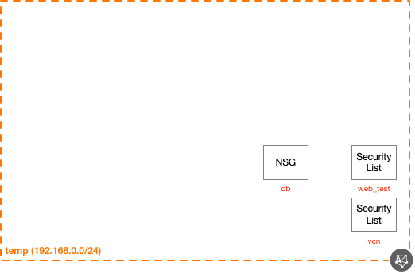

# OCI Network Security Module Example (Simple)

## Introduction

| Complexity |
|---|
| Simple |

This example shows how to utilize the network-security module in a very simplistic way, generating a couple of Security Lists.

The following resources are created in this example:

* 1x VCN
* 2x Security Lists
* 1x Network Security Group (NSG)

This is simply designed to show one way in which the network-security module can be used.

## Topology Diagram
This example is intended to the following OCI topology:



## Using this example
Prepare one variable file named `terraform.tfvars` with the required information. The contents of `terraform.tfvars` should look something like the following (or copy and re-use the contents of `terraform.tfvars.template`:

```
tenancy_ocid = "ocid1.tenancy.oc1..xxxxxxxxxxxxxxxxxxxxxxxxxxxxxxxxxxxxxxxxxxxxxxxxxxxxxxxxxxxx"
user_ocid = "ocid1.user.oc1..xxxxxxxxxxxxxxxxxxxxxxxxxxxxxxxxxxxxxxxxxxxxxxxxxxxxxxxxxxxx"
fingerprint= "xx:xx:xx:xx:xx:xx:xx:xx:xx:xx:xx:xx:xx:xx:xx:xx"
private_key_path = "~/.oci/oci_api_key.pem"
region = "us-phoenix-1"
default_compartment_ocid = "ocid1.compartment.oc1..xxxxxxxxxxxxxxxxxxxxxxxxxxxxxxxxxxxxxxxxxxxxxxxxxxxxxxxxxxxx"
```

Then apply the example using the following commands:

```
$ terraform init
$ terraform plan
$ terraform apply
```
